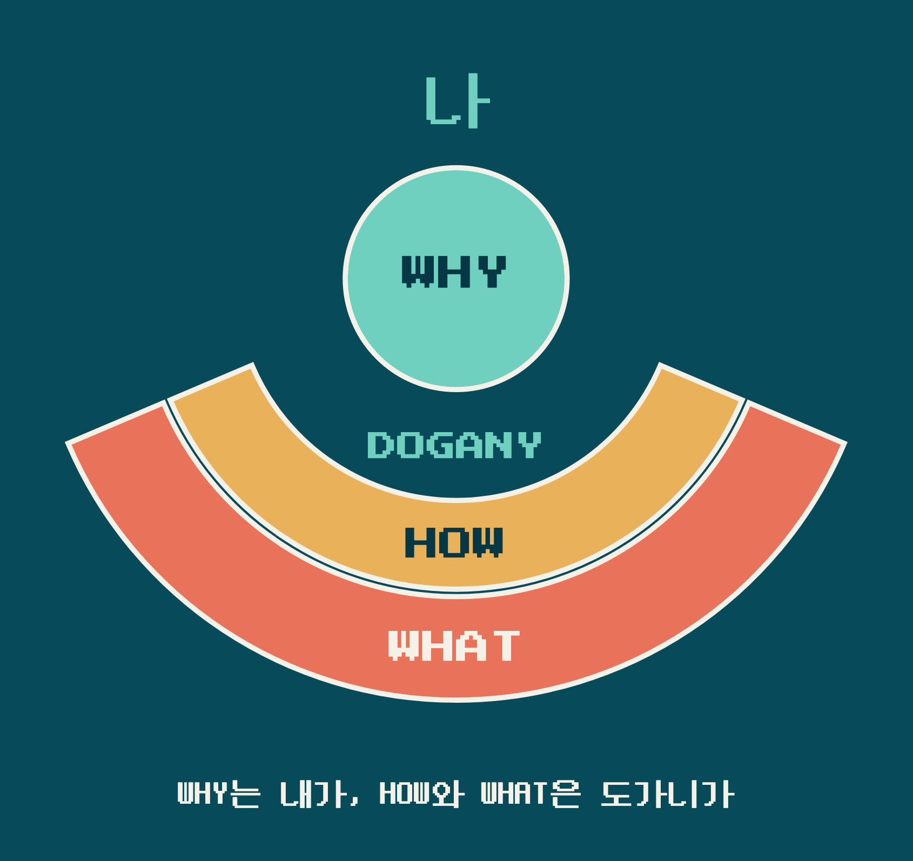
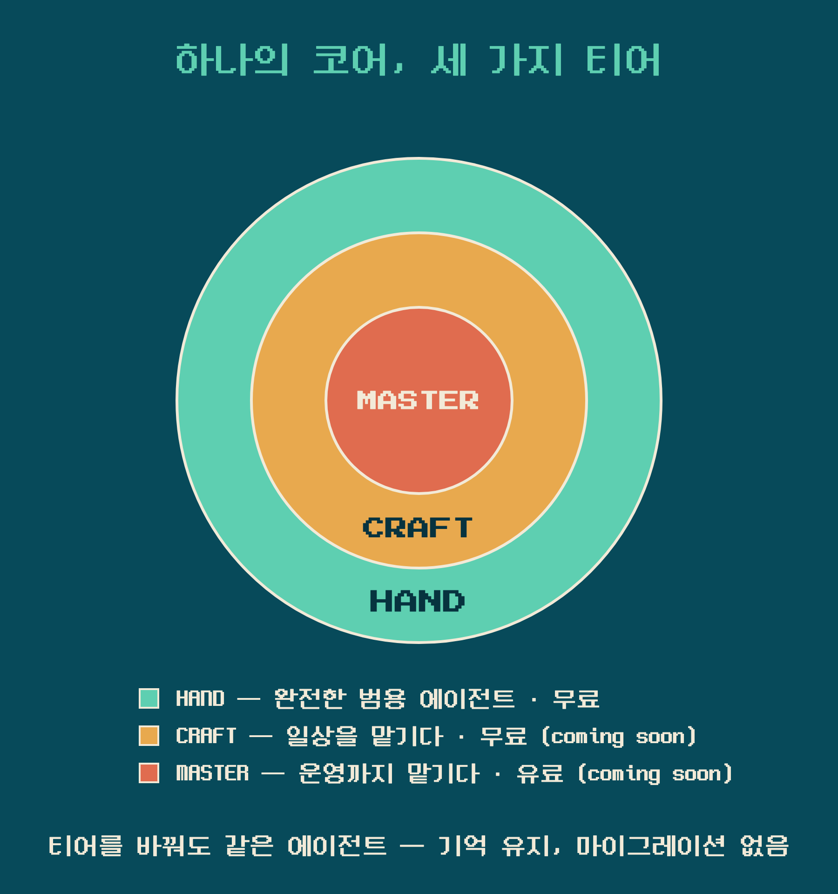
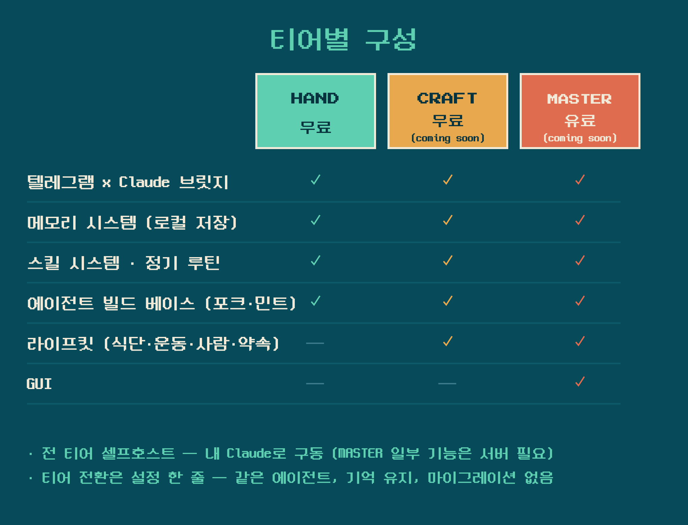
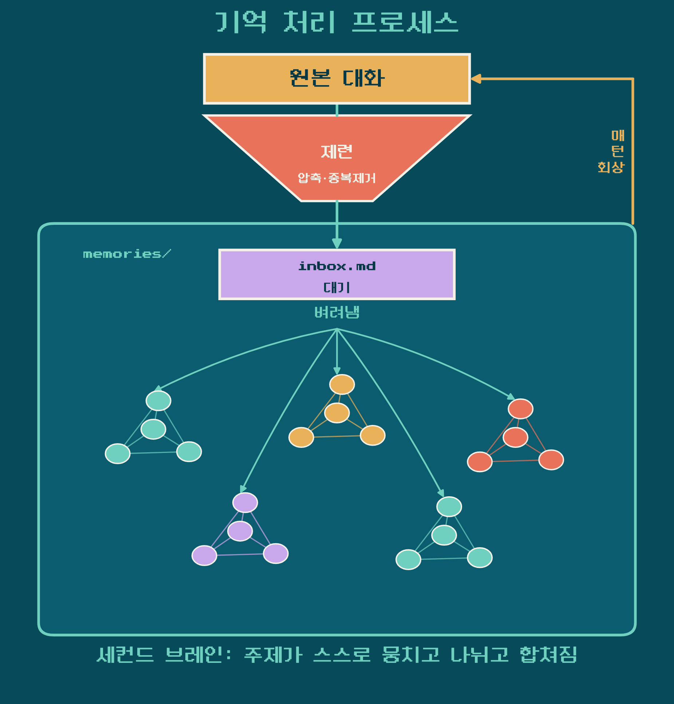
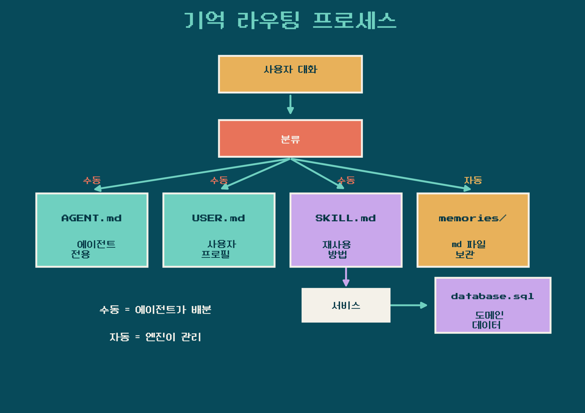

# dogany-agent (한국어)

[English README ->](README.md)

텔레그램으로 연락하는 나만의 Claude Code 에이전트 프레임워크.
기기가 켜져 있는 동안 늘 실행되는 개인 에이전트.
장기기억·정기 루틴·스킬 시스템을 갖추고 있습니다.

## 철학

- 내 삶의 CEO처럼: Why는 당신이 정하고, How와 What은 에이전트가
  제안하고 실행합니다. 당신은 결과물을 고르면 됩니다.
- 제련되는 기억: 나눈 대화가 압축되고 벼려져 세컨드 브레인이
  되고, 오래 쓸수록 나를 깊이 아는 에이전트가 됩니다.
- 매일 나아지는 나: Why를 정하고 결과물을 고르는
  과정에서 취향이 드러나고, 성장이 회고와 숫자로 눈에 보이게
  쌓입니다.
- 데이터는 당신의 것: 민트된 인스턴스의 기억·기록은 전부 로컬에
  남고, 배포되는 레포 트리에는 개인 데이터가 없으며 인스턴스 데이터는
  레포에 들어가지 않습니다.

## 티어

코어는 하나, 티어는 세 가지입니다.
에이전트를 내 손으로 빚고(HAND), 일상을 맡기고(CRAFT), 내 코어를 다 담은 작품으로 완성합니다(MASTER).

티어는 `.instance.conf`의 플래그(`DOGANY_TIER=lite|basic|pro`)이며,
별도 레포가 아닙니다. 이 단일 레포에 전부 공개되어 있고 DRM도 없습니다.
필드가 없으면 lite로 동작하고, 재민트·업데이트 시에도 유지됩니다.

- **HAND** (`lite`, 이번 배포) — 무료 베이스. 브릿지·장기기억·루틴·
  스킬을 갖춘 완전한 범용 에이전트입니다. 그 자체로 끝이어도 좋고,
  나만의 에이전트(QA 에이전트, 콘텐츠 에이전트, ...)를 만드는 베이스로
  써도 좋습니다. Lifekit 번들은 동면 상태로 동봉됩니다.
- **CRAFT** (`basic`, 곧 공개) — 역시 무료. 일상을 에이전트에 맡기는 층으로,
  HAND 위에 Lifekit 번들(sql 베이스 메모리, 정기 루틴, 도메인
  에이전트 오케스트레이션)이 켜집니다.
- **MASTER** (`pro`, 먼 미래에 공개) — 유일한 유료 층. GUI와 매니지드 호스팅까지
  얹는 단계로, 서버측 계정 연결로 활성화됩니다. 셀프호스트도
  가능합니다(일부 기능은 서버 필요).

업그레이드는 재설치가 아니라 상태 변경이라
기억과 정체성이 그대로 유지됩니다 — 마이그레이션이 없습니다. 설치
시점에 티어를 고르지 않는 것도 그래서입니다(모두 HAND로 시작).

## 메모리

매 턴, 관련 기억이 자동으로 컨텍스트에 주입됩니다 — 같은 얘기를 두 번
할 필요가 없습니다. 모든 기억은 로컬 Markdown이 정본이며, 벡터 인덱스
(FTS5 + 임베딩)는 선택 사항이고 언제든 재빌드 가능합니다.

두 가지 접근 방식:

- 핫 인젝트: `USER.md`와 `AGENT.md`는 매 턴 컨텍스트에 로드됩니다
  (`CLAUDE.md`의 `@` 임포트). 늘 작고 항상-관련성 있는 내용만 담습니다 —
  당신의 프로필과 에이전트 정체성은 콜드 상태가 되지 않습니다.
- 콜드 리콜: 나머지는 `memories/` 토픽 파일에 보관됩니다.
  `UserPromptSubmit` 훅이 하이브리드 검색(키워드 + 시맨틱)을 실행하고,
  모델이 메시지를 보기 전에 상위 매칭 결과를 주입합니다. 시맨틱 리콜은
  로컬에서 Ollama + bge-m3 모델이 실행 중일 때만 활성화됩니다(선택 사항).
  설치하지 않으면 엔진이 자동으로 키워드 전용(FTS) 검색으로 전환됩니다.

두 가지 스케줄 쓰기 패스로 기억을 최신 상태로 유지합니다:

- 야간 consolidate: 그날 대화를 `memories/inbox.md`로 제련합니다.
  잡음과 중복은 걷어내고, 1년 뒤에도 가치 있는 사실만 기록합니다.
  시크릿은 디스크에 쓰기 전에 자동 리댁팅됩니다.
- 주간 classify-inbox: `inbox.md` 항목을 `memories/` 토픽 파일로
  라우팅합니다(올바른 파일에 추가, inbox에서 제거). 엔진은 진짜 새로운
  클러스터에 `NEW:<label>`을 제안하거나, 통과된 잡음을 DROP할 수 있습니다.

쓰기 경로는 의도적입니다: 사실은 `대화 → inbox.md → 토픽 파일` 순으로
흐르며, 에이전트가 토픽 파일에 직접 쓰지 않습니다. 이렇게 볼트를
깔끔하고 감사 가능하게 유지합니다.

## 레포 구조

레포는 검증된 멀티 에이전트 트리를 반영합니다. 공유 코드는 루트에 올리고,
각 에이전트는 `agents/` 아래에 위치합니다.

- **`agents/main/`** — 기본 민트 대상으로 레포 콘텐츠가 아닙니다. 새 클론에는
  존재하지 않으며 gitignore 처리됩니다. `install.sh`가 `agents/.template`에서
  민팅하여 생성합니다. 민트된 인스턴스는 rules, `bridge/`, `memory-engine/`,
  `memories/`, `routines/`, `files/`, `worklog/`, `.telegram_bot/`, `.claude/`의
  실제 복사본(심링크 아님)을 갖습니다. 참조 구조는 `agents/.template/`에서
  확인하세요.
- **`agents/.template/`** — 민트 소스. 플레이스홀더(`__PROJECT_ROOT__`,
  `__AGENT_NAME__` 등)로 구성된 에이전트로, 프레임워크 스킬과 `RULES.md`가
  공유 루트에 심링크됩니다. `scripts/mint.sh`가 여기서 복사해(심링크 역참조)
  새 자립형 에이전트를 생성합니다.
- **`rules/`** — 공유되고 불변인 `RULES.md`와 `USER.example.md`. 템플릿이
  RULES.md를 심링크하고, 민트된 인스턴스는 실사본을 받습니다. 인스턴스의
  `USER.md` 스캐폴드는 `agents/.template/`에서 옵니다.
- **`skills/`** — 에이전트 간 공유 프레임워크 스킬(`dogany-cron-register`,
  `dogany-lifekit-setup`, `dogany-mailer`, `dogany-memory-search`,
  `dogany-proactive-push`, `dogany-reminder`, `dogany-skill-creator`,
  `dogany-user-onboarding`). 민트된 인스턴스는 `.claude/skills/` 아래에 실제
  복사본을 갖습니다. 도메인(lifekit) 스킬은 `.claude/skills-bundle/` 아래에
  DORMANT 상태로 동봉되고, `dogany-lifekit-setup` 스킬로만 활성화됩니다.
- **`database/`** — `lifekit.py`/`lifekit.sh`, 선택적 정형 데이터 레인(로컬
  SQLite "생활 OS": 식사, 운동, 사람, 일정). 코드만 포함 — `schema.sql`은
  구조이며 `*.db` 데이터는 미포함.
- **`service/`** — lifekit 코어 위의 안정적 SDK 파사드(`service.lifekit`).
  스킬은 raw 데이터 레이어 대신 이를 임포트합니다.
- **`scripts/`** — `agents/.template`과 공유 루트에서 독립 에이전트를 생성하는
  `mint.sh`.
- **`install.sh`** — 이중 언어(ko/en) 설치 마법사. 사전 요구사항 확인, 봇 토큰
  + 소유자 id 수집(born-locked), `scripts/mint.sh` 호출로 자립형 인스턴스 민팅,
  선택적 자동시작 서비스 설치를 수행합니다.

각 에이전트의 `bridge/`는 공식 `claude-agent-sdk`(in-tree 벤더링, `bridge/UPSTREAM.md`
참조)를 기반으로 하는 자립형 Telegram <-> Claude 브릿지입니다.

## 경로 독립성

고정된 부모 트리를 가정하지 않습니다.

- 민트된 인스턴스는 그 자체가 `PROJECT_ROOT`입니다. rules, 프레임워크 스킬,
  데이터베이스 스키마, 서비스 SDK의 실제 복사본(심링크 아님)을 갖습니다.
- 브릿지는 환경에서 `PROJECT_ROOT`를 읽습니다(`start.sh`가 launchd plist로
  설정). plist와 훅은 민트 시 `__PROJECT_ROOT__` 플레이스홀더를 치환합니다.
- `lifekit.sh`는 PATH의 모든 `python3`으로 실행됩니다(`LIFEKIT_PYTHON`으로
  재정의 가능). `lifekit.py`와 DB 경로는 스크립트 자체 디렉터리 기준으로
  해석됩니다.
- `service.lifekit` 파사드는 자기 위치에서 lifekit 코어를 해석합니다
  (`service/lifekit/__init__.py` -> `../../database/lifekit.py`).

## 바로 시작하기

1. 레포를 받아 설치 마법사를 실행합니다.

       git clone https://github.com/coolcoolk/dogany-agent ~/dogany-agent && cd ~/dogany-agent && bash install.sh

   위처럼 홈 폴더 바로 아래에 받으세요. macOS에서 문서/데스크탑/
   다운로드 폴더에 받으면 백그라운드 서비스가 읽지 못해 설치기가
   거부합니다.

2. 마법사가 언어·타임존·봇 토큰(BotFather에서 발급)·소유자 확인을
   차례로 안내하고, 자립형 에이전트 하나를 민트합니다(기본값
   `./agents/main`, 레포 내 gitignore 처리). 자동시작 서비스 설치와
   이메일 연결(에이전트 전용 계정 권장, 건너뛰기 가능)은 이 단계의
   선택 항목입니다.

3. 텔레그램을 열고 봇에게 인사하세요. 첫 대화에서 에이전트가 자기
   이름·말투를 물으며 온보딩을 시작합니다.

미리 보기만 하려면:

    bash install.sh --dry-run --lang ko

직접 경로를 지정해 민트하려면:

    bash scripts/mint.sh --root /path/to/instance --name myagent

`dogany-*` 스킬은 프레임워크 스킬로 `./update.sh`로 갱신됩니다. 직접
수정한 스킬이 있으면 `update.sh`가 감지하여 `.claude/skills/<skill>.user-<date>/`에
백업한 뒤 교체합니다. 지속적으로 커스터마이즈하려면 `dogany-` 이름이 아닌
스킬을 새로 만들어 그쪽을 편집하세요.

권장: 개인 계정 대신 에이전트 전용 Gmail/Apple 계정을 만드세요 — 개인
데이터와 격리되고, 이메일·연동에서 에이전트만의 정체성을 갖습니다.
계정 연결(이메일 발송 등)은 설치 중 선택 사항이며 나중에 추가할 수 있습니다.

## Windows (WSL2)

에이전트는 WSL2(진짜 리눅스 환경)를 통해 Windows에서 동작합니다. 네이티브
Windows는 별도 트랙입니다. 설치는 복사-붙여넣기 위주이며 터미널 경험이
없어도 됩니다.

### Windows에서 "항상 켜짐"의 의미

에이전트는 WSL2 안에서 실행되며 다음 상황에서 살아남습니다:
- 모든 터미널 창을 닫아도,
- 화면을 잠가도(Win+L),
- 기기가 절전에 들어갔다 깨어나도(절전 중에는 응답 불가, 깨어난 뒤 다시 응답).

에이전트는 다음 경우 멈춥니다:
- Windows에서 로그아웃할 때,
- 기기를 종료하거나 재시작할 때.

재시작이나 로그아웃 후에는 다음에 Windows에 로그인할 때 돌아옵니다 -- 그
전에는 아닙니다. 야간 자동 Windows 업데이트로 재시작된 뒤 잠금 화면에 머물러
있는 기기는, 누군가 로그인하기 전까지 에이전트가 실행되지 않습니다. 이는
Windows 플랫폼의 한계입니다: WSL은 대화형 세션 없이는 실행될 수 없습니다.

이 기기가 전용 상시 가동 기기라서 무인 재부팅에도 에이전트가 살아 있어야
한다면, Windows 자동 로그인을 직접 켜세요(netplwiz, 또는 비밀번호를 암호화된
LSA 시크릿으로 저장하는 Sysinternals Autologon). 절충점을 이해하세요: 자동
로그인을 켜면 기기 전원을 켠 누구나 당신의 Windows 세션에 들어옵니다. 물리적으로
안전한 기기에서만 사용하고, 로그인 시 잠금 단계를 함께 두세요(예: 로그인 태스크로
`rundll32.exe user32.dll,LockWorkStation` 실행) -- 그러면 에이전트는 잠금 화면
뒤에서 계속 돌아가는 동안 데스크톱은 즉시 잠깁니다.

상시 가동 권장: 기기를 AC 전원에 연결하고 절전을 "안 함"으로 설정하세요
(설정 > 시스템 > 전원, 또는 `powercfg /change standby-timeout-ac 0`) -- macOS와
동일한 권장 사항입니다.

### 설치 (Windows 11)

요구 사항: Windows 11(`vmIdleTimeout`이 Windows 11 설정), RAM 최소 8GB(음성
입력에는 16GB 권장), 여유 디스크 약 10GB.

1. WSL + Ubuntu 설치. PowerShell("관리자 권한으로 실행")에서:

       wsl --install

   메시지가 나오면 재부팅하세요. 이후 Ubuntu가 스스로 열리며 리눅스 사용자명과
   비밀번호를 만들라고 합니다: 사용자명은 반드시 영문자만 사용하세요(Windows
   계정명은 한글이어도 괜찮습니다). WSL이 이미 설치돼 있다면:
   `wsl --update` 후 `wsl --install -d Ubuntu`.

2. 에이전트 코드 + Claude Code 받기 (Ubuntu 창 안에서):

       git clone https://github.com/coolcoolk/dogany-agent ~/dogany-agent

   그런 다음 위 리눅스 설치와 동일하게 Claude Code를 설치하고 로그인(`claude`)
   하세요. 로그인 시 브라우저가 열리지 않으면, 출력된 URL을 Windows 브라우저에
   복사해 넣으세요.

3. Windows 쪽 설정. PowerShell(일반 사용자 -- 관리자 아님)에서:

       powershell.exe -ExecutionPolicy Bypass -File \\wsl.localhost\Ubuntu\home\<your-linux-username>\dogany-agent\windows\setup-windows.ps1

   이는 클론된 코드에 함께 들어 있는 설정 스크립트를 실행합니다(URL에서
   다운로드하는 것이 아닙니다). 터미널을 열어두지 않아도 에이전트가 살아 있도록
   설정하고, Ubuntu 안에서 systemd를 켜고, WSL을 잠깐 재시작합니다(Ubuntu 창이
   닫힙니다 -- 정상입니다). 관리자 권한이 필요 없습니다.

4. 에이전트 설치 (Ubuntu 다시 열기):

       cd ~/dogany-agent && bash install.sh

   표준 마법사가 처음부터 끝까지 한 번에 실행됩니다. 3단계를 건너뛴 경우,
   설치기는 어떤 질문도 하기 전에 5초 안에 멈추고 정확한 3단계 명령을 출력합니다.

5. 상시 가동 검증: 모든 Ubuntu 창을 닫고 2분 기다린 뒤 봇에게 메시지를
   보내세요. 반드시 답장해야 합니다.

6. 재부팅 계약 검증: Windows를 재시작하세요; 로그인 전에 봇에게 메시지를
   보내면 답장이 없어야 합니다(문서화된 플랫폼 한계). 로그인하고 최대 2분
   기다린 뒤 다시 메시지를 보내면 답장해야 합니다.

### Windows에서의 음성 모델

WSL에는 메모리 상한이 부여됩니다(`[wsl2] memory=`, 기본값
`min(hostRAM/2, 8)`GB, 최소 4GB). 8GB 기기에서는 `small` 음성 모델을
선택하거나 음성을 건너뛰세요; 음성과 시맨틱 메모리를 동시에 쓰려면 16GB
기기가 필요합니다.

상한이 모든 기기에서 최대 8GB이므로, 설치기의 자동 음성 추천은 큰 기기에서도
`small`에 머뭅니다. 16GB 이상 기기라면 상한을 올릴 수 있으며
(`setup-windows.ps1 -MemoryGB <N>` 재실행), 그러면 설치기가 medium 음성 모델을
추천할 수 있습니다.

### 문제 해결 (Windows)

- 모든 터미널을 닫은 뒤 몇 분 만에 봇이 조용해짐: keep-alive가 제거됐거나 WSL이
  유휴 종료됐습니다. 3단계(`setup-windows.ps1`)를 다시 실행하세요. 일회성으로는
  Ubuntu를 열거나 작업 스케줄러에서 `DoganyWSLKeepAlive` 태스크를 실행하세요.
- `systemctl --user`가 "Failed to connect to bus"라고 함(그리고 워치독이
  버스다운 알림을 보냄): `sudo systemctl restart user@$(id -u)`로 복구하세요.
  그래도 안 되면 PowerShell에서 `wsl --shutdown` 후 Ubuntu를 다시 여세요(이
  실패 지점을 공유하지 않는 전체 재활용).
- 한글 이름의 Windows 계정에서 Ubuntu 첫 실행 실패: `wsl --update` 후 재시도,
  또는 Ubuntu-22.04 설치.
- Windows 시간대는 바뀌었는데 에이전트에 반영 안 됨: PowerShell에서
  `wsl --shutdown` 후 Ubuntu를 다시 여세요.
- 절전에서 깨어난 뒤 시계가 이상함: Ubuntu에서 `sudo hwclock -s`.
- 조직에서 WSL 루트 접근(`wsl -u root`)을 막는 경우: `setup-windows.ps1`이
  수행하는 두 개의 루트 명령을 직접 실행하세요 -- `/etc/wsl.conf`에
  `[boot]\nsystemd=true`를 넣고, `sudo systemctl disable --now systemd-timesyncd`.
- 디스크 회수: WSL의 `ext4.vhdx`는 커지기만 하고 자동으로 줄지 않습니다.
  PowerShell에서 `wsl --shutdown` 후 `wsl --manage Ubuntu --set-sparse true`
  (Pro/Enterprise SKU에서는 `Optimize-VHD`).

### 제거 (Windows)

Windows 쪽 keep-alive와 설정을 제거하려면(배포판과 에이전트 데이터는 그대로
둡니다), PowerShell에서:

    powershell.exe -ExecutionPolicy Bypass -File \\wsl.localhost\Ubuntu\home\<your-linux-username>\dogany-agent\windows\setup-windows.ps1 -Uninstall

이는 예약 작업을 해제하고, `.wslconfig`에서 Dogany 키를 제거하며(먼저 백업),
리눅스 쪽 설정 마커를 지웁니다. 데이터를 파괴하는 `wsl --unregister <distro>`
명령은 출력만 하고 실행하지 않습니다 -- 직접 실행하기 전에 반드시 인스턴스
폴더를 백업하세요.

## 로컬에서 직접 대화하기 (텔레그램 없이)

에이전트의 실체는 봇이 아니라 폴더입니다. 텔레그램은 입구 중 하나일 뿐,
인스턴스 폴더에서 터미널 세션을 열면 같은 에이전트를 만납니다 -- 같은
정체성, 같은 기억, 같은 훅과 스킬:

    cd agents/main && claude

텔레그램과 CLI 대화는 별개 스레드지만 장기기억은 하나입니다. 야간 제련이
둘 다 읽기 때문에, 오늘 터미널에서 한 얘기를 내일 텔레그램이 기억합니다.
동시에 써도 안전합니다.

노트북 팁: 에이전트는 기기가 깨어 있는 동안만 동작합니다. 전원을 연결하고
시스템 잠자기를 꺼두세요(macOS: 시스템 설정 > 디스플레이 > 고급 > "전원
어댑터 연결 시 자동으로 잠자지 않음", 또는 `sudo pmset -c sleep 0`; 화면
잠자기는 무관합니다).

## 데이터와 프라이버시

- 봇은 소유자만 접근 가능합니다(설치 때 지정하거나 1회 클레임).
- 메모리(`memories/`), 기록 DB, 세션, 토큰은 전부 인스턴스 로컬이며
  git에 커밋되지 않습니다(`.gitignore`).
- 레포에는 코드와 빈 구조만 있습니다.

## Notes

- 코드는 English/ASCII로만 작성합니다. 마크다운 문서는 에이전트의
  작업 언어로 작성할 수 있습니다.
- 시크릿이나 개인 데이터는 커밋되지 않습니다(`.gitignore` 참조).
- 선택적 `lifekit` 레인은 민트 시 `database/schema.sql`로 초기화됩니다
  (빈 정형 레인, 사용자 데이터 없음).

## 라이선스

[LICENSE](LICENSE) 참조.
