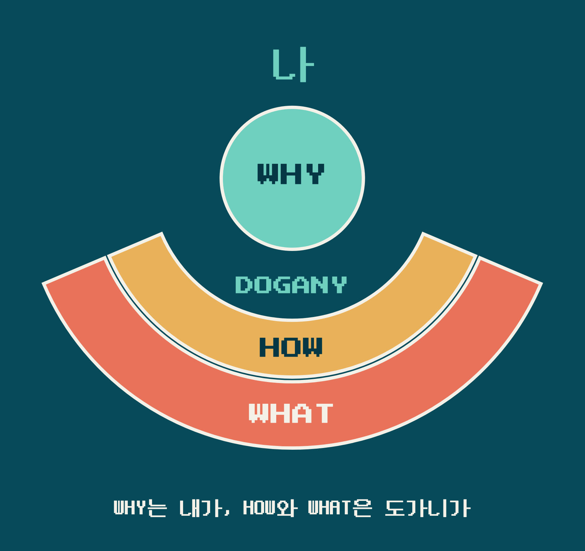
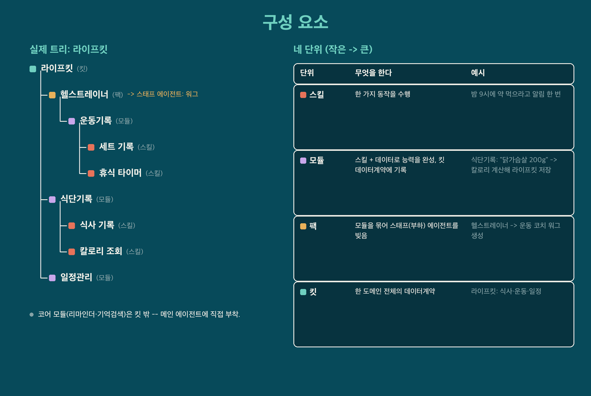
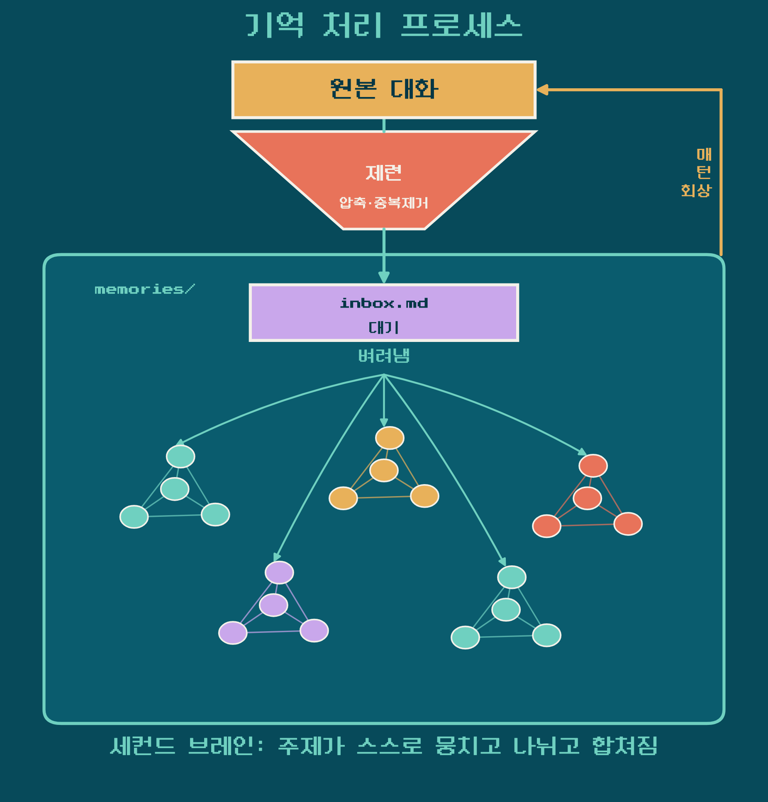

# dogany-agent (한국어)

[English README ->](README.md)

텔레그램으로 연락하는 나만의 Claude Code 에이전트. 내 기기(Mac, Linux,
Windows는 WSL2)에 살면서 기기가 켜져 있는 동안 늘 돌아가고, 나를 정말로
기억합니다 -- 장기기억, 정기 루틴, 스킬 시스템을 갖춘, 인스턴스마다 완전히
자립하는 개인 에이전트입니다. 배포 트리에는 개인 데이터가 전혀 없습니다.

## 설치 (2분)

    git clone https://github.com/coolcoolk/dogany-agent ~/.dogany/framework && cd ~/.dogany/framework && bash install.sh

마법사가 사전 요구사항을 확인하고(Claude Code가 없으면 대신 설치해 줍니다),
언어·타임존·봇 토큰(@BotFather에서 발급)을 차례로 물은 뒤 에이전트를
민트합니다. 자동시작 서비스와 이메일 계정 연결(전용 계정 권장)은 건너뛸 수
있는 선택 단계입니다.

텔레그램을 열고 봇에게 인사하세요. 봇은 소유자 없이 시작합니다: 일회용
클레임 코드를 출력하고, `/claim <코드>` 를 먼저 보낸 계정이 단독 소유자가
됩니다. 첫 대화가 곧 온보딩입니다 -- 에이전트가 자기 이름과 말투를 물어봅니다.

알아두면 좋은 것:

- 위처럼 `~/.dogany/` 아래에 클론하세요. macOS에서는
  문서/데스크탑/다운로드 폴더에 받지 마세요 -- 백그라운드 서비스가 읽지
  못해 설치기가 거부합니다.
- 아무것도 바꾸지 않고 전 과정을 미리 보려면:
  `bash install.sh --dry-run --lang ko`
- Windows는 WSL2가 필요합니다. 구현은 되었으나 검증하지 않은
  상태입니다.

## 철학

- 내 삶의 CEO처럼: Why는 당신이 정하고, How와 What은 에이전트가
  제안하고 실행합니다. 당신은 결과물을 고르면 됩니다.
- 제련되는 기억: 나눈 대화가 압축되고 벼려져 세컨드 브레인이
  되고, 오래 쓸수록 나를 깊이 아는 에이전트가 됩니다.
- 매일 나아지는 나: Why를 정하고 결과물을 고르는
  과정에서 취향이 드러나고, 성장이 회고와 숫자로 눈에 보이게
  쌓입니다.
- 데이터는 당신의 것: 민트된 인스턴스의 기억·기록은 전부 로컬에
  남고, 배포되는 레포 트리에는 개인 데이터가 없으며 인스턴스 데이터는
  레포에 들어가지 않습니다.

## 구성 요소

모든 것이 하나의 포함관계입니다. 가장 작은 단위부터 바깥으로:

- **스킬(skill)** -- 한 가지 동작: 리마인더 스킬은 밤 9시에 약 먹으라고
  알림 한 번을 보냅니다. 더 큰 단위들은 모두 스킬을 원자로 조립됩니다.
- **모듈(module)** -- 스킬 + 데이터로 완성되는 한 가지 능력: 식단기록
  모듈은 "닭가슴살 200g"을 칼로리로 계산해 라이프킷에 저장합니다.
- **팩(pack)** -- 모듈 + 지식을 묶어 스태프 에이전트를 빚는 번들:
  헬스트레이너 팩은 루틴을 짜고 챙기는 운동 코치가 됩니다.
- **킷(kit)** -- 한 도메인 전체의 데이터계약. 그 도메인의 모듈·팩이 같은
  스키마를 공유합니다: **라이프킷(LifeKit)**은 일상 전체(식사·운동·일정)를
  담당합니다. (다른 도메인 킷은 예정입니다.)

중첩 밖의 지름길이 둘 있습니다: 코어 모듈(리마인더·기억검색)은 킷을
건너뛰어 메인 에이전트에 직접 붙고, 팩을 설치하면 메인 아래에 스태프
에이전트가 생깁니다 -- 정체성과 기억을 갖는 단 하나뿐인 본체인 메인
에이전트가 킷을 장착하는 주체입니다.

## 메모리

당신의 프로필과 에이전트의 정체성은 매 턴 컨텍스트에 올라와 있습니다 --
같은 얘기를 두 번 할 필요가 없습니다. 나머지는 메시지를 보내는 순간
회수됩니다: 하이브리드 검색(키워드 + 시맨틱)이 기억 파일에서 상위 매칭을
찾아 모델이 읽기 전에 끼워 넣습니다. 시맨틱 검색은 로컬 Ollama + bge-m3
모델이 필요하며, 없으면 키워드 검색만으로 동작합니다. 기억 자체는 평범한
로컬 Markdown이고, 검색 인덱스는 선택 사항이며 언제든 재빌드할 수 있습니다.

쓰기도 그만큼 신중합니다. 매일 밤 그날의 대화가 인박스로 제련됩니다 --
잡음과 중복은 걷어내고, 시크릿은 리댁팅하고, 1년 뒤에도 가치 있는 사실만
남깁니다. 매주 인박스 항목이 토픽 파일로 분류됩니다. 에이전트는 기억
파일에 직접 쓰지 않으므로 볼트는 깔끔하고 감사 가능하게 유지됩니다.

밑에서 라우팅이 어떻게 도는지는 코드가 기준입니다.

## Windows

Windows에서는 WSL2가 필요합니다. 구현은 되었으나 검증하지 않은
상태입니다. 알아둘 플랫폼 한계 하나: WSL2에서는 재부팅 후 Windows에
로그인해야 에이전트가 돌아옵니다. 그 전에는 아닙니다.

## 로컬에서 직접 대화하기 (텔레그램 없이)

에이전트의 실체는 봇이 아니라 폴더입니다. 텔레그램은 입구 중 하나일 뿐,
터미널에서 `dogany`를 실행하면 같은 에이전트를 만납니다 -- 같은
정체성, 같은 기억, 같은 훅과 스킬:

    dogany

텔레그램과 CLI 대화는 별개 스레드지만 장기기억은 하나입니다. 야간 제련이
둘 다 읽기 때문에, 오늘 터미널에서 한 얘기를 내일 텔레그램이 기억합니다.
동시에 써도 안전합니다.

직접 폴더를 열어 대화하는 방법도 있습니다:

    cd ~/.dogany/main && claude

노트북 팁: 에이전트는 기기가 깨어 있는 동안만 동작합니다. 전원을 연결하고
시스템 잠자기를 꺼두세요. macOS: 시스템 설정 > 배터리 > 옵션 > "디스플레이가
꺼져 있을 때 전원 어댑터 연결 시 자동으로 잠자기 방지"를 켜거나(macOS 버전에
따라 메뉴 이름이 다를 수 있습니다) `sudo pmset -c sleep 0` 을 실행하세요.
외부 모니터를 연결한 클램셸 모드가 아닌 이상 덮개를 닫으면 기기가 잠자기에
들어가니 덮개를 닫지 마세요. 화면 잠자기(화면만 꺼짐)는 무관합니다.

## 업데이트

- 텔레그램에서 에이전트에게 요청: "업데이트해줘"
- 또는 로컬에서 실행: `dogany update`

에이전트는 최신 발행 릴리즈 태그에 스스로를 고정하고 -- 릴리즈 노트가 딸린
버전 릴리즈만 받게 됩니다 -- 내장 스킬을 갱신합니다. 기억, 정체성, 개인
데이터는 변경되지 않습니다. 내장 스킬을 직접 수정했다면 업데이트가 교체
전에 백업해 두며, 지속적으로 커스터마이즈하려면 스킬을 자기 이름으로 복사해
그쪽을 편집하세요.

## 데이터와 프라이버시

- 봇은 소유자 잠금입니다: 첫 접촉에서 클레임하면 다른 누구도 당신의
  에이전트에 접근할 수 없습니다.
- 모든 개인 데이터 -- 기억, 기록, 세션, 토큰 -- 는 인스턴스 디렉터리에
  있으며 레포나 git 히스토리에 절대 들어가지 않습니다.
- 레포에는 코드와 빈 구조만 있습니다.

## 내부 구조

- **`agents/.template/`** 이 청사진입니다: `install.sh`가 여기서 에이전트를
  민트합니다(기본값 `~/.dogany/main`). 완전 자립 복사본이라 인스턴스의
  어떤 것도 이 레포를 되가리키지 않으며, 어디에 있든 그대로 동작합니다.
- **`skills/`** 에는 모든 에이전트가 처음부터 갖는 내장 스킬이 있습니다:
  리마인더, 기억검색, 스케줄링, 온보딩 등.
- 생활 기록 능력(식사·일정·인간관계 등)은 별도 라이프킷 팩(레포
  `dogany-lifekit`)에서 옵니다. 민트 후 설치되며, 에이전트에게 켜 달라고
  하면 됩니다.
- 각 에이전트의 `bridge/`는 공식 `claude-agent-sdk` 기반의 자립형
  Telegram <-> Claude 브릿지입니다.

기여자 수준의 상세 -- 민트 역학, 훅 배선, 기억 라우팅, 팩 게이팅 -- 는
별도 문서로 두지 않습니다. 코드를 보시면 됩니다.

## 라이선스

[Apache 2.0](LICENSE).
