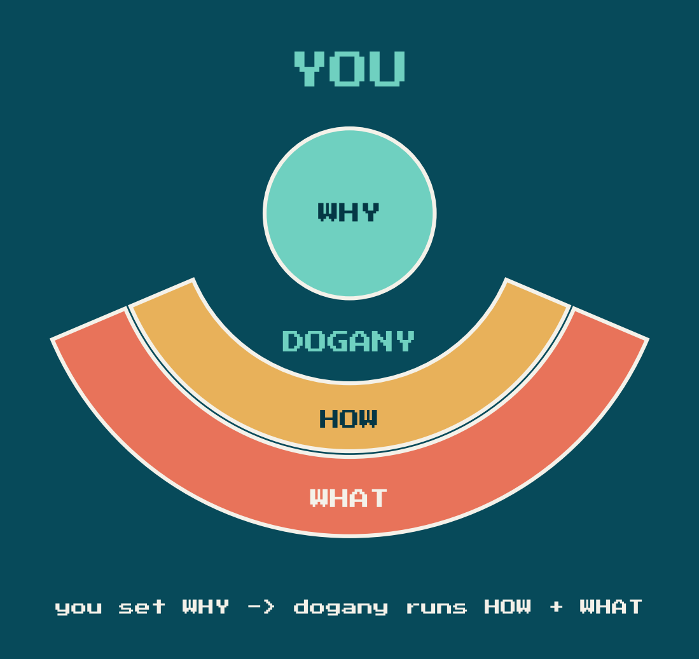
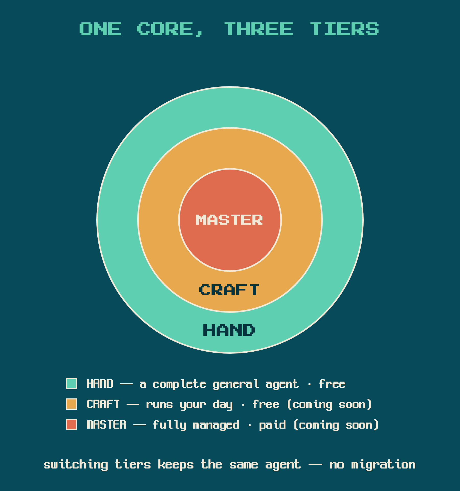
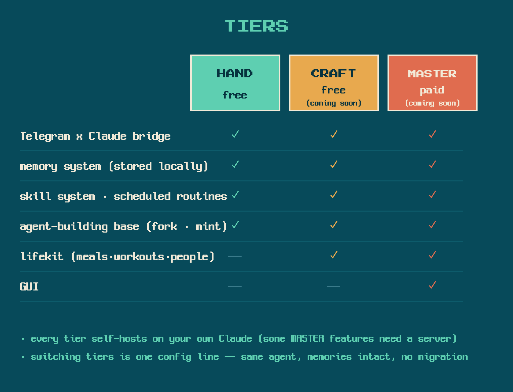
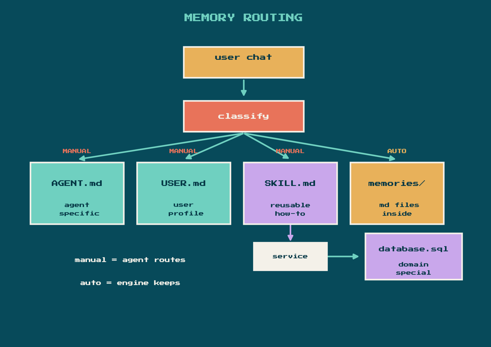
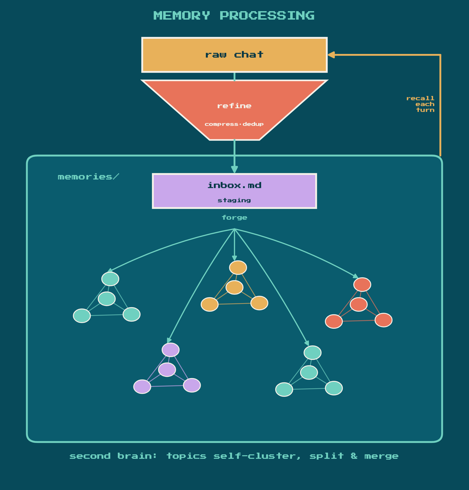

# dogany-agent

[한국어 안내 -> README-ko.md](README-ko.md)

Your own Claude Code agent, reachable over Telegram. It lives on your own
machine (Mac/Linux; Windows coming soon), always running while your machine is on,
and comes with long-term memory, scheduled routines, and a skill system. Run `install.sh`,
drop in a bot token, and you have a persistent personal agent -- fully
self-contained per instance, with zero personal data baked in.

## Philosophy

- CEO of your own life: you set the Why; your agent proposes and runs
  the How and the What, and you choose among outcomes.
- Memory, forged: conversations are compressed and refined into a second
  brain -- the longer you live with your agent, the deeper it knows you.
- A better you, daily: deciding Whys and picking outcomes surfaces your
  taste, and growth becomes visible in retrospectives and numbers.
- Your data is yours: a minted instance keeps memories and records local;
  the shipped tree carries zero personal data, and instance data never
  enters the repo.

## Tiers

One core, three tiers. You shape your agent by hand (HAND), entrust it with
your day (CRAFT), and complete a work that carries your core (MASTER).

A tier is a flag in `.instance.conf` (`DOGANY_TIER=lite|basic|pro`), not a
separate repo -- everything ships open in this single repo, no DRM; the tier
field is a plain line on purpose. A missing field means lite. The field
survives re-mints and updates (preserve-if-present: kept if present, default
written if absent).

- **HAND** (`lite`, this release) -- the free base: a complete general-purpose
  agent with bridge, long-term memory, routines, and skills. Great as-is, and
  also a clean base to build YOUR OWN agent on (QA agent, content agent, ...),
  fork-friendly by design. The lifekit bundle ships dormant.
- **CRAFT** (`basic`, coming soon) -- also free; for entrusting your daily
  life to the agent: the lifekit bundle (SQL-based memory, scheduled routines,
  domain-agent orchestration) turns on, on top of everything in HAND.
- **MASTER** (`pro`, further out) -- the only paid tier: a GUI and managed
  hosting on top of CRAFT, activated by account linkage. Self-hosting still
  works; only some features need a server.

Upgrading is an entitlement flip plus additive activation -- memories and
identity are preserved, never re-minted. There is deliberately no tier picker
at install time: every fresh mint starts as HAND, and switching later is a
state change, not a reinstall (set the tier in `.instance.conf`, then ask
your agent to activate the bundle). MASTER is activated by account linkage,
not by a local flag.

## Memory

Every turn, relevant memory is automatically recalled and injected into
context -- you never re-explain yourself. Memory is all local Markdown and is
the source of truth; a vector index (FTS5 + embedding) is optional and
rebuildable anytime.

Two layers of access:

- Hot inject: `USER.md` and `AGENT.md` are loaded into context on every turn
  (via `@` imports in `CLAUDE.md`). These stay small and always-relevant --
  your profile and the agent's identity are never cold.
- Cold recall: everything else lives in `memories/` topic files. The
  `UserPromptSubmit` hook runs a hybrid search (keyword + semantic) and splices
  in the top matches before the model sees your message. Semantic recall requires
  Ollama with the bge-m3 model running locally (optional); without it, the engine
  automatically falls back to keyword-only (FTS) recall.

Where a fact lands is decided first -- routing is the big map. Durable
knowledge is classified into one of four homes: the agent's identity
(`AGENT.md`), your profile (`USER.md`), a reusable procedure (`SKILL.md`,
which may persist domain records through the service layer into
`database.sql` -- the CRAFT-tier lane), or everything else into `memories/`.
The first three are routed manually by the agent; the last lane is AUTO --
the engine keeps it without anyone lifting a finger.

 database.sql, CRAFT tier), or memories/ topic files; manual routing is agent-driven, the AUTO lane is engine-driven and expanded in the next diagram">

Zooming into the AUTO lane (the `memories/` box above): two scheduled write
passes keep it accurate with zero manual effort:

- Nightly consolidate: distills the day's chat into `memories/inbox.md`.
  Noise and duplicates are dropped; only facts worth keeping a year from now
  are written. Secrets are redacted at the choke point before any write.
- Weekly classify-inbox: routes `inbox.md` items into topic files under
  `memories/` (append to the right file, remove from inbox). The engine can
  propose `NEW:<label>` for a genuinely new cluster, or DROP noise that slipped
  through.

The write path is intentional: facts flow `chat -> inbox.md -> topic files`,
never written directly to topic files by the agent. This keeps the vault
clean and auditable.

## Repo layout

The repo mirrors the proven multi-agent tree: shared code is hoisted to the
root, and each agent lives under `agents/`.

- **`agents/main/`** -- the repo-internal scaffold mint target (dev-mode /
  fallback; the end-user default install is `~/.dogany/main`), NOT repo content:
  it does not exist in a fresh clone and is gitignored. `install.sh` creates it by minting
  from `agents/.template`, producing a self-contained instance whose `CLAUDE.md`
  (loader) imports `RULES.md` (immutable operating rules), `AGENT.md` (the
  agent's own identity -- a blank onboarding skeleton by default), and `USER.md`
  (the owner's profile, blank by default). A minted instance carries real copies
  (never symlinks) of everything -- rules, `bridge/`, `memory-engine/`,
  `memories/`, `routines/`, `files/`, `worklog/`, `.telegram_bot/`, and
  `.claude/`. The reference structure to read lives in `agents/.template/`.
- **`agents/.template/`** -- the mint source. A placeholder-ized agent
  (`__PROJECT_ROOT__`, `__AGENT_NAME__`, etc.) with framework skills and
  `RULES.md` symlinked to the shared roots. `scripts/mint.sh` copies from here
  (dereferencing the symlinks) to stamp out a new self-contained agent.
- **`rules/`** -- the shared, immutable `RULES.md` plus `USER.example.md`.
  The template symlinks RULES.md in; a minted instance gets a real copy. The
  instance `USER.md` scaffold comes from `agents/.template/`.
- **`skills/`** -- framework skills shared across agents (`dogany-cron-register`,
  `dogany-lifekit-setup`, `dogany-mailer`, `dogany-memory-search`,
  `dogany-proactive-push`, `dogany-reminder`, `dogany-skill-creator`,
  `dogany-user-onboarding`). A minted instance carries its own real copies under
  `.claude/skills/`. Domain (lifekit) skills -- `diet-log`, `workout-log`,
  `appointment-log`, `relationship`, `task-update` -- ship DORMANT as real dirs
  under `.claude/skills-bundle/` and are activated only post-mint by the
  `dogany-lifekit-setup` skill, which creates an instance-local symlink
  `.claude/skills/<id> -> ../skills-bundle/<id>`. They are never pre-placed as
  live dirs under `.claude/skills/` (that would make the bundle un-gateable).
- **`database/`** -- `lifekit.py` / `lifekit.sh`, an optional structured-data
  lane (a local SQLite "life OS": meals, workouts, people, appointments). CODE
  ONLY -- `schema.sql` is the structure; no `*.db` data is shipped.
- **`service/`** -- a stable SDK facade (`service.lifekit`) over the lifekit
  core; skills import this rather than the raw data layer.
- **`scripts/`** -- `mint.sh`, which instantiates a standalone agent from
  `agents/.template` + the shared roots and writes the instance `.env`
  (single generator; secrets arrive via the `DOGANY_BOT_TOKEN` /
  `DOGANY_EMAIL_PW` environment variables, never argv).
- **`install.sh`** -- a bilingual (ko/en) setup wizard: checks prerequisites,
  collects a bot token + owner id (born-locked), and calls `scripts/mint.sh` to
  mint a single self-contained instance (mint writes the full `.env` from the
  collected values), then optionally installs an autostart service.

Each agent's `bridge/` is a self-contained Telegram <-> Claude bridge built on
the official `claude-agent-sdk` (vendored in-tree; see `bridge/UPSTREAM.md`; the
Python venv is NOT shipped). The `.claude/settings.json` wires Claude Code hooks:
SessionStart recap + onboarding check + version check, UserPromptSubmit memory
recall + skill-feedback gate, PreToolUse token-gate, PostToolUse card follow-up
+ skill-feedback record.

## Path independence

Nothing assumes a fixed parent tree.

- A minted instance IS its own `PROJECT_ROOT`: it carries real copies (never
  symlinks) of the rules, framework skills, database schema, and service SDK.
- The bridge reads `PROJECT_ROOT` from the environment (set by `start.sh` via
  the launchd plist); the plists and hooks use `__PROJECT_ROOT__` placeholders
  substituted at mint time.
- `lifekit.sh` runs with any `python3` on PATH (override via `LIFEKIT_PYTHON`);
  `lifekit.py` and its DB path resolve relative to the script's own directory.
- The `service.lifekit` facade resolves the lifekit core from its own location
  (`service/lifekit/__init__.py` -> `../../database/lifekit.py`).

## Setup

1. Clone the repo and run the wizard:

       git clone https://github.com/coolcoolk/dogany-agent ~/dogany-agent && cd ~/dogany-agent && bash install.sh

   Clone under your home folder as shown. On macOS, do NOT clone into
   Documents/Desktop/Downloads -- background services cannot read those
   folders (the installer refuses such paths).

2. The wizard walks you through language, timezone, bot token (from
   BotFather) + owner id, then mints a single self-contained agent (default
   `~/.dogany/main`, a hidden directory in your home folder). Installing an
   autostart service and connecting an email account (a dedicated one is
   recommended; skippable) are optional steps here.

3. Open Telegram and greet your bot. The first conversation starts
   onboarding: the agent asks for its own name and tone.

To preview without touching anything:

    bash install.sh --dry-run --lang en

To mint manually into a chosen directory:

    bash scripts/mint.sh --root /path/to/instance --name myagent

First run triggers onboarding: `AGENT.md` is a blank skeleton, and the
SessionStart onboarding check walks you through naming the agent and setting
tone. `USER.md` fills in over time via the memory write path.

The `dogany-*` skills are framework and are refreshed by `./update.sh`. If you
edited one, `update.sh` detects the change and backs your copy up to
`.claude/skills/<skill>.user-<date>/` before replacing it -- so no edit is lost.
To customize durably, copy the skill under your own (non-`dogany-`) name and edit
that instead of editing a `dogany-*` skill directly.

Telling the agent to "update yourself" means CONSUME the latest framework into
this instance -- it is not cutting a release. The agent runs
`routines/self-update.sh`, a zero-argument wrapper that resolves its own
instance root, pins the framework repo to the latest PUBLISHED RELEASE tag
(never main HEAD -- you only ever receive versioned releases with release
notes), then runs `update.sh` against itself. You never have to point it at
a directory. Developers dogfooding unreleased main can opt out with
`DOGANY_UPDATE_CHANNEL=main` in `.instance.conf`.

Recommended: create a dedicated Gmail/Apple account for the agent instead of
reusing your personal one -- isolation from personal data and a clean agent
identity for email and integrations. Connecting that account (email send, etc.)
is an optional, opt-in step during install (you can skip it and add it later).

## Windows (WSL2)

The agent runs on Windows through WSL2 (a real Linux environment). Native
Windows is a separate track. The install is copy-paste friendly and needs no
prior terminal experience.

### What "always on" means on Windows

The agent runs inside WSL2 and survives:
- closing every terminal window,
- locking the screen (Win+L),
- the machine sleeping and waking (it is unreachable while the machine
  sleeps, and answers again after it wakes).

The agent STOPS when you:
- sign out of Windows,
- shut down or restart the machine.

After a restart or sign-out, the agent comes back the next time you sign in
to Windows -- not before. A machine sitting at the lock screen after an
overnight automatic Windows Update restart has NO agent running until
someone signs in. This is a Windows platform limit: WSL cannot run without
an interactive session.

If this machine is a dedicated always-on box and you need the agent to
survive unattended reboots, enable Windows automatic sign-in yourself
(netplwiz, or Sysinternals Autologon which stores the password as an
encrypted LSA secret). Understand the tradeoff: with auto-logon, anyone who
powers on the machine gets your Windows session. Use it only on a physically
secure machine, and pair it with a lock-on-logon step (e.g. a logon task
running `rundll32.exe user32.dll,LockWorkStation`) so the desktop locks
immediately while the agent keeps running behind the lock screen.

Recommendation for always-on use: keep the machine on AC power and set sleep
to Never (Settings > System > Power, or `powercfg /change standby-timeout-ac 0`)
-- the same advice as macOS.

### Install (Windows 11)

Requirements: Windows 11 (we rely on `vmIdleTimeout`, a Windows 11 setting),
8GB RAM minimum (16GB recommended for voice input), ~10GB free disk.

1. Install WSL + Ubuntu. In PowerShell ("Run as administrator"):

       wsl --install

   Reboot when prompted. Ubuntu then opens by itself and asks you to create a
   Linux username and password: USE ONLY ENGLISH LETTERS for the username
   (your Windows account name can stay Korean -- that is fine). If WSL was
   already installed: `wsl --update`, then `wsl --install -d Ubuntu`.

2. Get the agent code + Claude Code (inside the Ubuntu window):

       git clone https://github.com/coolcoolk/dogany-agent ~/dogany-agent

   Then install Claude Code and log in (`claude`), same as the Linux setup
   above. If a browser does not open for login, copy the printed URL into your
   Windows browser.

3. Windows-side setup. In PowerShell (normal user -- NOT administrator):

       powershell.exe -ExecutionPolicy Bypass -File \\wsl.localhost\Ubuntu\home\<your-linux-username>\dogany-agent\windows\setup-windows.ps1

   This runs the setup script that came with the cloned code (nothing is
   downloaded from a URL). It keeps the agent alive with no terminal open,
   turns on systemd inside Ubuntu, and briefly restarts WSL (your Ubuntu
   window will close -- that is expected). It needs no administrator elevation.

4. Install the agent (reopen Ubuntu):

       cd ~/dogany-agent && bash install.sh

   The standard wizard runs once, start to finish. If step 3 was skipped, the
   installer stops in under five seconds -- before any question -- and prints
   the exact step 3 command.

5. Verify keep-alive: close ALL Ubuntu windows, wait 2 minutes, message your
   bot. It must reply.

6. Verify the reboot contract: restart Windows; BEFORE signing in, message the
   bot -- it must NOT reply (the documented platform limit). Sign in, wait up
   to 2 minutes, message again -- it must reply.

### Voice model on Windows

WSL is given a memory cap (`[wsl2] memory=`, defaulted to `min(hostRAM/2, 8)`GB
with a 4GB floor). On an 8GB machine, choose the `small` voice model or skip
voice; running voice AND semantic memory together needs a 16GB machine.

Because the cap is at most 8GB on every host, the installer's automatic voice
recommendation stays at `small` even on large machines. On a 16GB+ host you
may raise the cap (re-run `setup-windows.ps1 -MemoryGB <N>`) and then the
installer can recommend the medium voice model.

### Troubleshooting (Windows)

- Bot silent minutes after you close all terminals: the keep-alive was
  removed or WSL idled out. Re-run step 3 (`setup-windows.ps1`). One-off: open
  Ubuntu, or run the `DoganyWSLKeepAlive` task from Task Scheduler.
- `systemctl --user` says "Failed to connect to bus" (and the watchdog sends
  a bus-down alert): recover with `sudo systemctl restart user@$(id -u)`. If
  that fails, in PowerShell run `wsl --shutdown`, then reopen Ubuntu (a full
  recycle that does not share this failure point).
- Ubuntu first launch fails on a Korean-named Windows account: run
  `wsl --update` and retry, or install Ubuntu-22.04.
- Timezone changed on Windows but not in the agent: in PowerShell run
  `wsl --shutdown`, then reopen Ubuntu.
- Clock looks wrong after the machine wakes from sleep: in Ubuntu run
  `sudo hwclock -s`.
- If your organization blocks root access to WSL (`wsl -u root`): run the two
  root-side commands that `setup-windows.ps1` performs by hand -- ensure
  `[boot]\nsystemd=true` in `/etc/wsl.conf`, and
  `sudo systemctl disable --now systemd-timesyncd`.
- Reclaim disk: WSL's `ext4.vhdx` grows and never auto-shrinks. In PowerShell:
  `wsl --shutdown`, then `wsl --manage Ubuntu --set-sparse true` (or
  `Optimize-VHD` on Pro/Enterprise SKUs).

### Uninstall (Windows)

To remove the Windows-side keep-alive and setup (the distro and agent data are
left intact), in PowerShell:

    powershell.exe -ExecutionPolicy Bypass -File \\wsl.localhost\Ubuntu\home\<your-linux-username>\dogany-agent\windows\setup-windows.ps1 -Uninstall

That unregisters the scheduled task, removes the Dogany keys from `.wslconfig`
(backing it up first), and removes the Linux-side setup marker. It PRINTS, but
never runs, the data-destroying `wsl --unregister <distro>` command -- back up
your instance folder before you ever run that yourself.

## Talk to it locally (no Telegram needed)

The agent is the folder, not the bot. Telegram is just one door; a terminal
session in the instance directory is the SAME agent -- same identity, memory,
hooks, and skills:

    cd ~/.dogany/main && claude

Telegram and CLI conversations are separate threads but share one long-term
memory: the nightly consolidate pass reads both, so tomorrow's Telegram chat
remembers today's terminal session. Running both at once is safe.

Tip for laptops: the agent runs only while the machine is awake. Keep it on
AC power and disable system sleep (macOS: System Settings > Displays >
Advanced > "Prevent automatic sleeping on power adapter", or
`sudo pmset -c sleep 0`; display sleep is fine).

## Data and privacy

- The bot is owner-locked: during install you specify an owner Telegram id (or
  claim it on first message). No one else can reach your agent.
- All personal data -- `memories/`, the lifekit record DB, sessions, and bot
  tokens -- lives in your instance directory and is gitignored. It never enters
  the repo or its git history.
- The repo ships code and empty scaffolding only. No user data is baked in.

## Notes

- English/ASCII in code; markdown docs may be in the agent's working language.
- No secrets or personal data are committed; see `.gitignore`.
- The optional `lifekit` lane is initialized from `database/schema.sql` at mint
  time (empty structured lane; no user data seeded).
